# Architecture Overview

**jealcovi-chatbot** is a Python-based application inspired by ChatGPT, aiming to provide knowledge to evidence portafolio. This document outlines the high-level architecture, key components of the system, and details the project structure.

## System Architecture Diagram

### Example Diagram:

<style>
img[src="diagram.svg"] {
    width: 10%;
    height: auto;
}
</style>



Project Structure

```
--------------

jealcovi-chatbot/             # my-chatgpt-playground
├── app/
│   ├── **init**.py           # Main initialization of the Flask application
│   ├── api/
│   │   ├── **init**.py       # Registers the API blueprints
│   │   ├── v1/
│   │   │   ├── resources/
│   │   │   │   ├── **init**.py   # Resource sub-module initialization
│   │   │   │   ├── chat.py       # Handles chat-related requests
│   │   │   │   ├── documents.py  # Handles document management requests
│   │   │   │   ├── users.py  # Handles document management requests
│   │   │   │   └── agents.py  # Handles document management requests
│   │   │   ├── schemas/
│   │   │   │   ├── **init**.py   # Schemas sub-module initialization
│   │   │   │   ├── chat.py       # Chat data validation schemas
│   │   │   │   └── document.py   # Document data validation schemas
│   │   └── errors.py         # Custom error handlers and error logging
│   ├── agents/
│   │   ├── **init**.py       # Agent sub-module initialization
│   │   ├── base_agent.py     # Base class for all agents
│   │   ├── openai.py   # Agent utilizing OpenAI's API
│   │   ├── azure_openai.py    # Agent utilizing Azure Cognitive Services
│   │   └── huggingface        # Additional agents as required
│   ├── vector_db/
│   │   ├── **init**.py       # Vector database sub-module initialization
│   │   ├── base_vector_db.py # Base class for vector database implementations
│   │   ├── azure_aisearch.py  # Azure-based vector search implementation
│   │   ├── qdrant             # qdrant-based vector search implementation
│   │   └── ...               # More vector databases as needed
│   ├── utils/
│   │   ├── **init**.py       # Utility sub-module initialization
│   │   ├── logging.py        # Logging configuration and utilities
│   │   ├── config.py         # Configuration management
│   │   └── metrics           # metrics modules
│   ├── models/
│   │   ├── **init**.py       # Model sub-module initialization
│   │   ├── chat\_model.py     # Chat model definitions
│   │   ├── document\_model.py # Document model definitions
│   │   └── ...               # More model files as required
│   └── dependencies.py       # Dependency injection configuration
├── tests/
│   ├── **init**.py           # Tests sub-module initialization
│   ├── test\_api.py           # API component tests
│   ├── test\_agents.py        # Tests for agent implementations
│   └── ...                   # Additional tests for different components
├── migrations/               # Database migration scripts
├── dockerfile                # Dockerfile for containerizing the application
├── requirements.txt          # Project dependencies
├── .env.example              # Example environment configuration file
└── run.py                    # Entry point for running the Flask application
```
Logic Flow
----------
```
1. The user submits a prompt or query through the UI.
2. The API receives the request and pre-processes the input.
3. The API interacts with the appropriate agent based on the request type or user preferences.
4. The agent might utilize the vector database to retrieve relevant information or context.
5. The agent generates a response based on its capabilities and the available information.
6. The API returns the response to the UI for presentation to the user.
```
Future Considerations
--------------------
* Scalability: As the project grows, consider strategies for handling increased data volume and user traffic. This might involve using distributed systems, load balancing, and caching mechanisms.
* Modularity: Design components with clear interfaces and abstractions to enable easy extension and replacement in the future.
* Monitoring and Logging: Implement robust logging and monitoring systems to track performance, identify issues, and ensure the system's health.